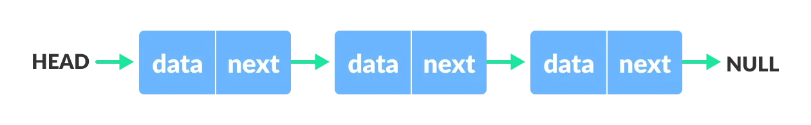
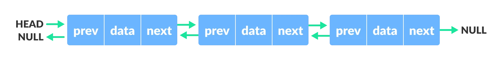
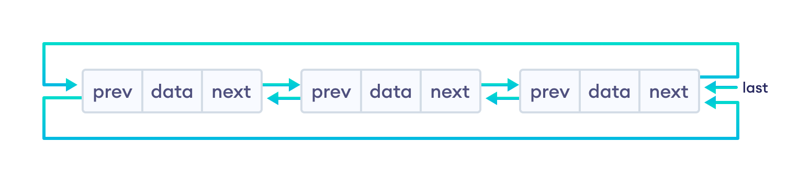

## Linked List
A linked list is a linear data structure that includes a series of connected nodes. Here, each node stores the data and the address of the next node. For example,



You have to start somewhere, so we give the address of the first node a special name called HEAD. Also, the last node in the linked list can be identified because its next portion points to NULL.


Types of linked lists:
1. Singly linked list  − The nodes only point to the address of the next node in the list.
1. Doubly linked list  − The nodes point to the addresses of both previous and next nodes.
1. Circular linked list  − The last node in the list will point to the first node in the list. It can either be singly linked or doubly linked.

### Representation of a Linked List
Let's see how each node of the linked list is represented. Each node consists:

- A data item
- An address of another node

```
class Node:
    def __init__(self, value = None):
        self.data = value
        self.next = None
```

## Singly Linked List
It is the most common. Each node has data and a pointer to the next node.  Traversals can be done in one direction only as there is only a single link between two nodes of the same list.


```
class Node:
    def __init__(self, value = None):
        self.data = value
        self.next = None
```

:eyes: [see implementation and operations]()

## Doubly Linked List
We add a pointer to the previous node in a doubly-linked list. Thus, we can go in either direction: forward or backward.


```
class Node:
    def __init__(self, value = None):
        self.data = value
        self.next = None
        self.prev = None
```
:eyes: [see implementation and operations]()
## Circular Linked List
A circular linked list is a variation of a linked list in which the last element is linked to the first element. This forms a circular loop.


A circular linked list can be either singly linked or doubly linked.

- for singly linked list, next pointer of last item points to the first item
- In the doubly linked list, prev pointer of the first item points to the last item as well.


:eyes: [see implementation and operations]()


### Linked List Complexity
**Time Complexity**

| |Worst case	|Average Case|
|:--- |:--- |:--- |
|Search|	O(n)|	O(n)|
|Insert|	O(1)|	O(1)|
|Deletion|	O(1)|	O(1)|

**Space Complexity:** O(n)


### Linked List Applications
- Dynamic memory allocation
- Implemented in stack and queue
- In undo functionality of softwares
- Hash tables, Graphs