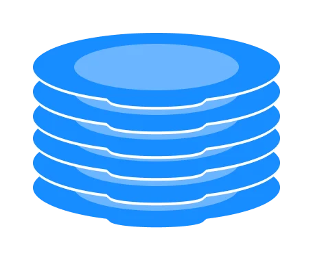
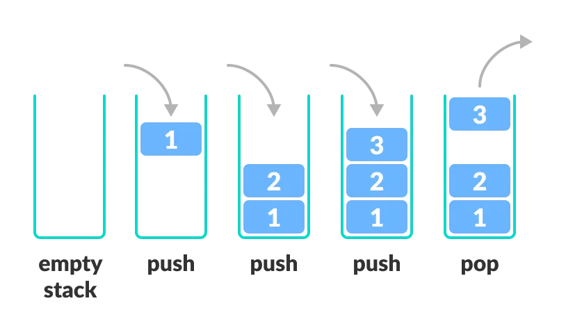
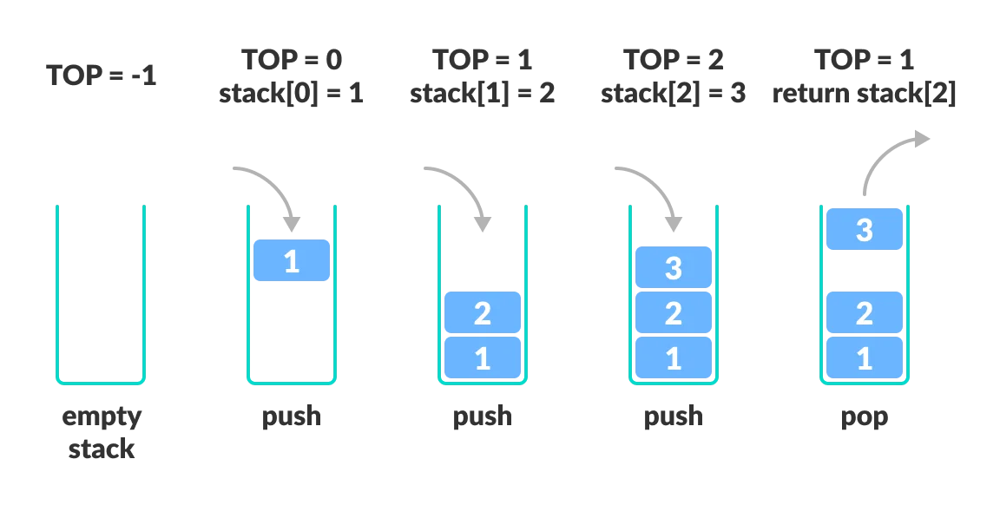

# Stack Data Structure

A stack is an ordered collection of items where the addition of new items and the removal of existing items always takes place at the same end.  It's
linear data structure that follows the principle of Last In First Out (LIFO). This means the last element inserted inside the stack is removed first.

It provides an ordering based on length of time in the collection. Newer items are near the top, while older items are near the base.

You can think of the stack data structure as the pile of plates on top of another.

## LIFO Principle of Stack
In programming terms, putting an item on top of the stack is called push and removing an item is called pop.

A Stack ADT allows all data operations at one end only. At any given time, we can only access the top element of a stack.

A stack can be implemented by means of Array, Structure, Pointer, and Linked List. Stack can either be a fixed size one or it may have a sense of dynamic resizing. 

### Basic Operations of Stack

There are some basic operations that allow us to perform different actions on a stack.
- **Stack()**: creates a new stack that is empty. It needs no parameters and returns an empty stack.
- **Push(item)**: Add an element to the top of a stack.It needs the item and returns nothing.
- **Pop()**: Remove an element from the top of a stack. It needs no parameters and returns the item. The stack is modified.
- **IsEmpty()**: Check if the stack is empty. It needs no parameters and returns a boolean value.
- **IsFull()**: Check if the stack is full
- **Peek()**: Get the value of the top element without removing it. It needs no parameters. The stack is not modified.
- **size()**: returns the number of items on the stack. It needs no parameters and returns an integer.

## Working of Stack Data Structure
The operations work as follows:

1. A pointer called TOP is used to keep track of the top element in the stack.
1. When initializing the stack, we set its value to -1 so that we can check if the stack is empty by comparing TOP == -1.
1. On pushing an element, we increase the value of TOP and place the new element in the position pointed to by TOP.
1. On popping an element, we return the element pointed to by TOP and reduce its value.
1. Before pushing, we check if the stack is already full
1. Before popping, we check if the stack is already empty

### Stack Time Complexity
For the array-based implementation of a stack, the push and pop operations take constant time, i.e. O(1)

## Applications of Stack Data Structure
Although stack is a simple data structure to implement, it is very powerful. The most common uses of a stack are:

- To reverse a word - Put all the letters in a stack and pop them out. Because of the LIFO order of stack, you will get the letters in reverse order.
- In compilers - Compilers use the stack to calculate the value of expressions like 2 + 4 / 5 * (7 - 9) by converting the expression to prefix or postfix form.
- In browsers - The back button in a browser saves all the URLs you have visited previously in a stack. Each time you visit a new page, it is added on top of the stack. When you press the back button, the current URL is removed from the stack, and the previous URL is accessed.