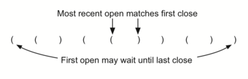

## Balanced Parenthesis

**Balanced parentheses** means that each opening symbol has a corresponding closing symbol and the pairs of parentheses are properly nested.e.g
`(()()()())`
`(((())))`
`(()((())()))`

The challenge then is to write an algorithm that will read a string of parentheses from left to right and decide whether the symbols are balanced. To solve this problem we need to make an important observation.

 As you process symbols from left to right, the most recent opening parenthesis must match the next closing symbol

Also, the first opening symbol processed may have to wait until the very last symbol for its match.

Closing symbols match opening symbols in the reverse order of their appearance; they match from the inside out. This is a clue that **`stacks`** can be used to solve the problem.

### Steps
- Starting with an empty stack, process the parenthesis strings from left to right.
- If a symbol is an opening parenthesis, push it on the stack as a signal that a corresponding closing symbol needs to appear later.
- If, on the other hand, a symbol is a closing parenthesis, pop the stack. As long as it is possible to pop the stack to match every closing symbol, the parentheses remain balanced. 
- If at any time there is no opening symbol on the stack to match a closing symbol, the string is not balanced properly. 
- At the end of the string, when all symbols have been processed, the stack should be empty. 